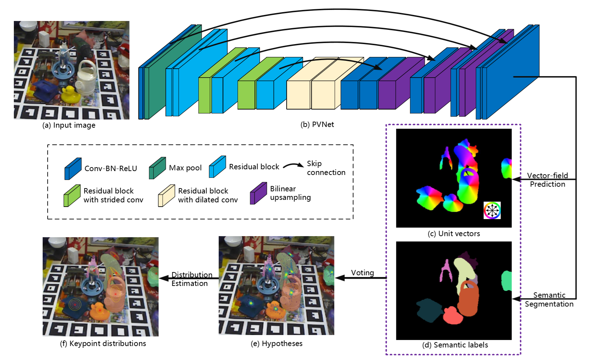
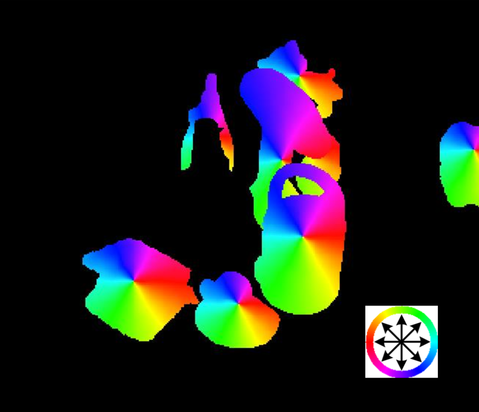
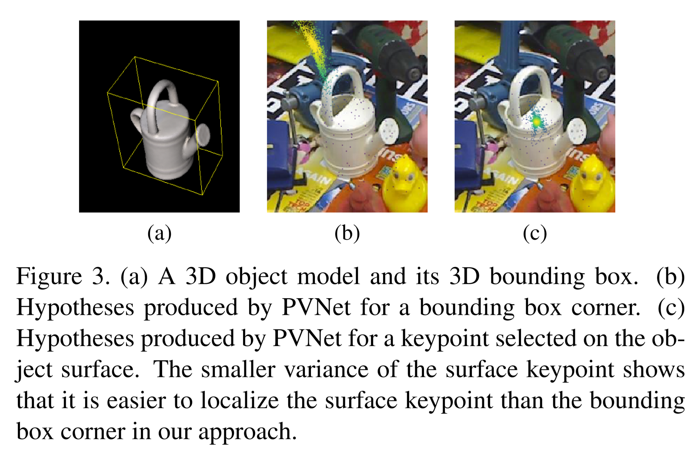
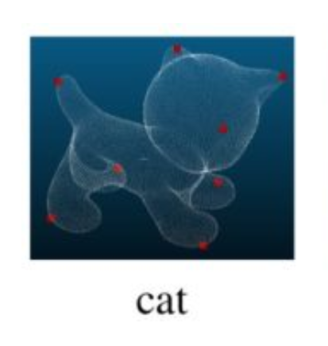

## PVNet

### 算法流程
1. 在2D图片中检测物体的关键点；
2. 将2D-3D对应；
3. 使用PnP计算物体6D位姿

### 局限性
1. 传统方法常使用local descriptor（局部描述）来解决6D位姿问题，没有表面特征问题的物体，local descriptor提取效果较差。
而且6D位姿网络搜索空间大，导致网络泛化能力一般。
2. 对Occlusion(occ-遮挡，物体局部部位被其他物体遮挡)与Truncation(trn-截断, 物体在图像中只显示一部分，被自身遮挡)的物体仍然有局限性。

### 局限性问题解决思路
1. 用可见部位的物体信息检测关键点，然后每个(所有)像素预测一个指向物体关键点的方向向量
2. 方向向量场能让网络学习刚体物体的结构性质
3. 方向向量场可以预测与Truncation状态下物体的6D位姿

### 论文提出的新方法
#### 一种新的关键点定位方法

 
RGB图片 input->网络 output-> 语义分割后的物体切割色块图与指向物体关键点的向量场，通过Ransac voting在方向向量场得到物体关键点 
下图为向量场图片: 

 
右下角轮盘代表像素的指向方向，指向的方向就是关键点的方向，所有颜色的集合点就是关键点。
 

 

 
将传统bounding box 8个角关键点的方法替换使用farthest point sampling，生成物体表面的八个关键点，减少不确定性

### 数据集
- linemod
- linemod_orig （加上深度的数据集）
- occlusion linemod （occ类型数据集）
- truncation linemod （trn类型数据集）

### 相关算法
#### 3D-2D：PnP算法原理(n为需要3D空间点的数量与，用来求相机位姿)
PnP：Perspective-n-Point 
算法相关解释文章 
https://blog.csdn.net/u014709760/article/details/88029841 
https://blog.csdn.net/luohuiwu/article/details/80722542

### 相关论文
PoseCNN: A Convolutional Neural Network for 6D Object Pose Estimation in Cluttered Scenes 
paper: https://arxiv.org/abs/1711.00199
